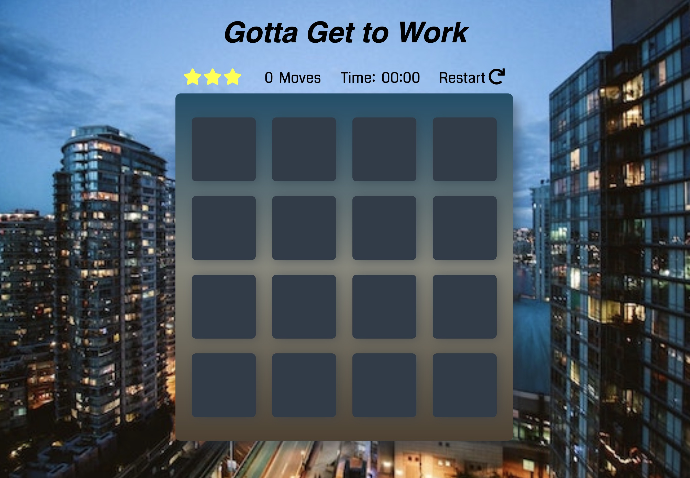

# Memory Game: Udacity Project 2
This browser-based memory game is a remake of the classic Concentration game, but with a new twist. ***Gotta Get to Work*** has a career theme and is a tongue-in-cheek attempt to mimic the stress of getting to work on time, by whatever means possible.

## Copy the Files from GitHub

### Download the files from GitHub to your computer
1. Click the green _Clone or download_ button on GitHub.
2. Select *Download ZIP*.
3. Open your Downloads folder and right-click the ZIP file.
4. Select either the _Unzip_ or _Uncompress_ option. Then select the folder to which you want to save the files.

### Fork the repository to your own GitHub account
1. Create a GitHub account if you don't already have one.
2. Click the *Fork* link near the top right of my GitHub repository.
3. The files will be forked to your GitHub repository.

## How to Play
The game board consists of 8 pairs of matched images--a total of 16 cards--turned face down until the game begins. The cards are randomly shuffled each time the game is started. Cards are flipped one at a time by clicking a card. The objective of the game is to match all 16 cards. Only two cards can be shown at a time. If the images match, the cards remain face up. If they do not match, they are turned over so the images do not show.

The game contains the following features:

* *Timer.* A stopwatch is activated when the game begins. It is stopped when the game ends.

* *Star Rating.* Assigned based on the number of moves it takes to complete the game.
  * 3 stars = 26 moves or less
  * 2 stars = 27-32 moves
  * 1 star = more than 32 moves

* *You Won!* When all 16 cards are matched, a modal is displayed to congratulate the user. It contains:
  * The number of moves it took to win the game
  * The player's star rating
  * _Play Again_ button to restart the game
  * Close box to close the modal without restarting the game

## Constraints and Known Bugs
This game uses the HTML5 dialog element to open a modal when the user has won the game. For best results, please use one of the following browsers, as other browsers may not support the dialog element yet.
* Chrome version 37 or later
* Opera version 24 or later

Clicking on individual cards too quickly could cause unpredictable results and the game might not work as intended. So please take your time and enjoy the game! Life is too short to deal with code glitches.

## Languages and Resources Used
* HTML, CSS, and javaScript
* Google Fonts
* Fontawesome
* Background image: free download from Pexel
* Shuffle function: http://stackoverflow.com/a/2450976
* Starter code from Udacity

## Contributions

This is my first javaScript project. Comments, suggestions, and *gentle* criticism are welcome, but please don't be mean. We all have to crawl before we fly. If you would like to use my code, feel free to download it.
